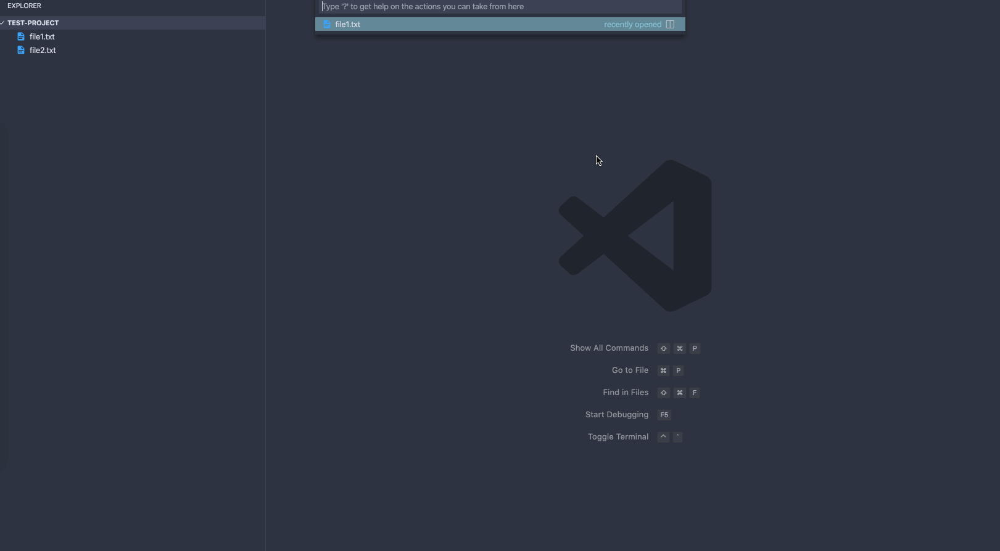

# onemark

Onemark is a simplistic, straight to the point bookmarking extension. You can save lines and go back to them in a matter of seconds.

## Features

The most important feature of this extension is it's simplicity. It basically does four things and it does them well.

- Save a line to your marks list
- Go to a saved line
- Remove saved line
- Clear the entire list of marks

That's it.

## Extension Settings

No settings to configure. Just install it and use it. Simple.

## Known Issues

No known issues.

## Release Notes

### 0.0.2

Don't allow setting marks on unsaved files
Add "bugs" field to the manifest

### 0.0.1

Initial release of onemark